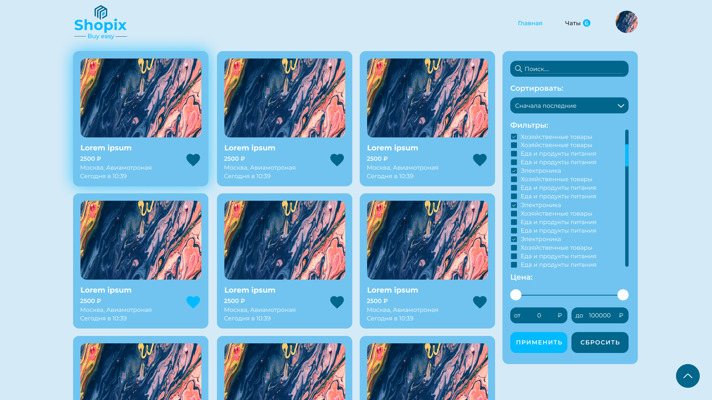

# Shopix



**Shopix** — это веб-приложение, повторяющее функционал популярного сервиса объявлений Avito. Проект включает все основные возможности оригинального сайта, за исключением чатов.

---

## Функционал

- **Публикация объявлений**: Добавление новых объявлений с подробным описанием, фотографиями и категориями.
- **Просмотр и поиск**: Удобный просмотр всех объявлений с возможностью фильтрации и сортировки.
- **Категории**: Разделение объявлений по категориям для быстрого поиска.
- **Личный кабинет**: Управление объявлениями и профилем пользователя.
- **Работа с изображениями**: Загрузка и обработка изображений для объявлений.
- **Отзывы**: Пользователи могут оставить отзыв на продавца.
- **Контейнеризация**: Приложение упаковано в Docker для удобного развертывания.

---

## Технологии

- **Архитектура**: FSD (Feature-Sliced Design) для упорядоченного и масштабируемого кода.
- **Фронтенд**:
  - **React**: Основной фреймворк для построения пользовательского интерфейса.
  - **TypeScript**: Типизация для повышения надежности разработки.
  - **Zustand**: Управление состоянием приложения.
  - **TanStack Query**: Работа с серверными данными (загрузка, кеширование, синхронизация).
  - **React Hook Form**: Удобная работа с формами.
  - **CSS Modules**: Локальная стилизация компонентов.
- **CI/CD**:
  - **GitHub Actions**: Автоматизация тестирования и деплоя.
- **Контейнеризация**:
  - **Docker**: Упаковка приложения для простого развертывания.

---

## Запуск лоакльно

Сделайте клон репозитория

```bash
  git clone https://github.com/Tomato1337/shopix-frontend.git
```

Перейдите в дирректорию репозитория

```bash
  cd my-project
```

Установите зависимости

```bash
  npm install
```

Настройте API_KEY для Yandex Geodecoder.
Создайте .env файл в корневой дирректории и вставьте туда ключ:
https://developer.tech.yandex.ru/

```bash
  VITE_YANDEX_API_KEY=PASTE_HERE_API_KEY
```

Запустите сервер

```bash
  npm run dev
```
